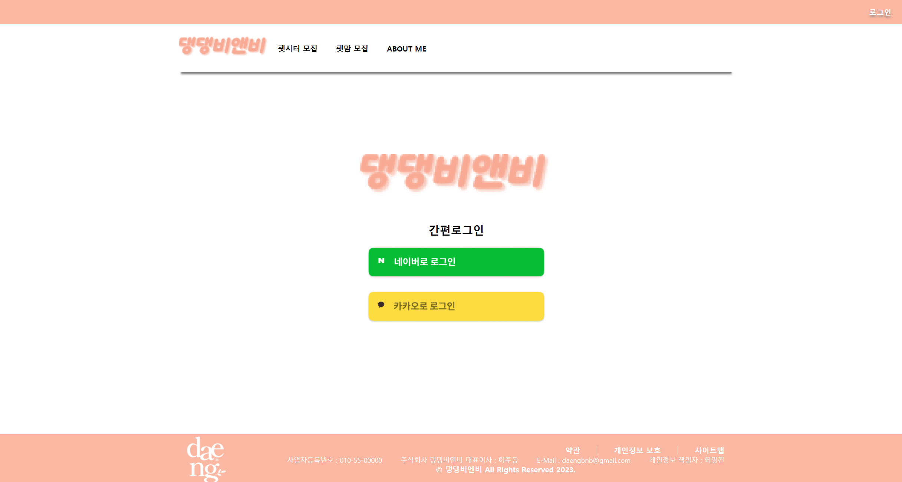

___
## 프로젝트 설명
**DDbnb 댕댕비엔비로 소셜 로그인을 통하여**  
**자신의 애견동물을 돌봐주는 사람을 모집하는 펫시터,**  
**자신에게 애견동물을 맡길 사람을 펫맘을 모집하는 게시판을 작성하는 프로젝트입니다.**  
**신청목록에서 신청자의 정보를 보고 쪽지를 통해 협의하고 확정, 경험한 뒤 리뷰를 작성하게 됩니다.**  
**마이페이지에서는 자신의 경력과 정보들을 작성하며 볼 수 있으며,**  
**지금까지 작성 된 리뷰와 별점이 보이기에 신용성을 확인 할 수 있습니다.**
___
## 맡은 역할
**DBA 데이터베이스 구축 설계**  
**소셜 로그인, 로그아웃, 탈퇴 기능**  
**AccessToken을 받아서 프로필 생성, 수정 기능**  
**CI & CD 구축과 AWD 배포 최적화**
___
# LOGIN 관련 CODE.
___
## Frontend CODE.
### `LoginPage.js`

~~~java
import style from './MainStyle.module.css';

const KAKAO_REST_API_KEY = '202bf1013addf514255b52a8c9c69ebf';
const KAKAO_REDIRECT_URI = `https://${process.env.REACT_APP_LOGIN_URL}/kakao/callback`;
const KAKAO_AUTH_URI = `https://kauth.kakao.com/oauth/authorize?client_id=${KAKAO_REST_API_KEY}&redirect_uri=${KAKAO_REDIRECT_URI}&response_type=code`;

const NAVER_CLIENT_ID = 'T0mWG2VjAfBH9cYz6Qrf';
const NAVER_REDIRECT_URI = encodeURI(`https://${process.env.REACT_APP_LOGIN_URL}/login/oauth2/code/naver`);
const NAVER_STATE_STRING = 'login';
const NAVER_AUTH_URI = `https://nid.naver.com/oauth2.0/authorize?response_type=code&client_id=${NAVER_CLIENT_ID}&redirect_uri=${NAVER_REDIRECT_URI}&state=${NAVER_STATE_STRING}`;

const loginHandler = (platform) => {

    switch (platform) {
        case 'N':
            window.location.href = NAVER_AUTH_URI;
            break;
        case 'K':
            window.location.href = KAKAO_AUTH_URI;
            break;
        default:
            break;
    }
}

function LoginPage() {
    return (
        

            <h1></h1>
            <h2> 간편로그인 </h2>

            
 loginHandler('N')}>
            

             
            
 loginHandler('K')}>
            

        

    )
}

export default LoginPage;
~~~
**코드 설명**
- Kakao 와 Naver 플랫폼 이미지의 버튼들이 있습니다. 
- Kakao 버튼을 클릭하면 KAKAO_AUTH_URI의 주소 값으로 이동합니다.
- Kakao계정으로 로그인 할 수 있는 페이지가 나오게 됩니다.

___
### `KakaoPage.js`

~~~java
import { useEffect } from "react";
import { useNavigate } from "react-router-dom";
import { callKakaoLoginAPI } from "../../api/LoginAPI";
import { useDispatch } from "react-redux";
import { getCurrentMember } from "../../api/MemberAPICalls";

function KakaoPage() {
    const code = new URL(window.location.href).searchParams.get('code');
    const navigate = useNavigate();
    const dispatch = useDispatch();

    useEffect(() => {
        dispatch(callKakaoLoginAPI(code))
            .then(() => {
                const token = JSON.parse(window.localStorage.getItem('accessToken'));
                dispatch(getCurrentMember(token.memberId))
                    .then((member) => {
                        if (member === "새로운회원") {
                            navigate("/loginprofile", { replace: true });
                        } else {
                            navigate("/", { replace: true });
                        }
                    });
            })
    }, [code, dispatch, navigate]);

    return null;
}

export default KakaoPage;
~~~
**코드 설명**
- Kakao 페이지에서 로그인을 하면 code를 callKakaoLoginAPI(code)로 보낸다.
- code에 있는 accessToken을 token으로 정의합니다.
- token에 있는 memberId로 멤버를 조회합니다.
- - 신규 회원일 경우 프로필을 등록하는 페이지로 가집니다.
- - 기존 회원일 경우 메인 홈페이지로 이동하게 됩니다. 
- - token.memberId가 "새로운 회원"일 경우 신규 회원
___
### `LoginAPi.js`
~~~java
import { IS_LOGIN } from "../modules/LoginModule";

export const callKakaoLoginAPI = (code) => {

    const requestURL = `http://${process.env.REACT_APP_RESTAPI_URL}/api/v1/login/kakaocode`;

    return async (dispatch, getState) => {

        let data = { code: code }

        const result = await fetch(requestURL, {
            method: 'POST',
            headers: {
                "Content-Type": 'application/json',
                "Accept": '*/*'
            },
            body: JSON.stringify(data)
        }).then(res => res.json());
        if (result.status === 200) {
            window.localStorage.setItem('accessToken', JSON.stringify(result.data.token));
            dispatch({ type: IS_LOGIN });
        }
    };
}

export const callKakaoLogoutAPI = () => {

    const requestURL = `http://${process.env.REACT_APP_RESTAPI_URL}/api/v1/login/kakaologout`;

    return async (dispatch, getState) => {
        const accessToken = JSON.parse(window.localStorage.getItem('accessToken'));
        const result = await fetch(requestURL, {
            method: 'POST',
            headers: {
                "Content-Type": 'application/json',
                "Authorization": accessToken.access_token
            }
        }).then(res => res.json());
        if (result.status === 200) {
            window.localStorage.removeItem('accessToken');
            dispatch({ type: IS_LOGIN });
            window.location.reload();
        }
    };
}
~~~
**코드 설명**
###### 로그인
- backend에서 지정한 requestURL로 요청합니다.
- 'data' 객체를 생성하여 'code'속성 인자를 'code'값으로 할당합니다.
- fetch 함수를 사용하여 카카오 로그인 API를 호출합니다.
- 전달된 code 값과 함께 POST 요청을 서버로 보냅니다.
- 서버로부터 응답을 받아 result 변수에 할당합니다.
- 만약 서버로부터의 응답이 성공적이라면 result 객체의 data 속성에 있는 token 값을 로컬 스토리지에 저장합니다.
###### 로그아웃
- backend에서 지정한 requestURL로 요청합니다.
- fetch 함수를 사용하여 카카오 로그아웃 API를 호출합니다.
- POST 요청을 보내며 서버로부터 응답을 받아 result 변수에 할당합니다.
- 응답이 성공적이라면 로컬 스토리지에 있는 엑세스 토큰을 삭제합니다.
___
## BackEnd
### `LoginController.java`
~~~java
    @PreAuthorize("permitAll()")
    @ApiOperation(value = "카카오 인가 코드 받아와서 액세스 토큰 발급")
    @PostMapping("/kakaocode")
    public ResponseEntity<?> getKakaoCode(@RequestBody Map<String, String> code) {
        /* 인가 코드로 액세스 토큰 발급 */
        KakaoAcessTokenDTO kakaoToken = loginService.getAccessToken(code.get("code"));

        /* 액세스 토큰으로 DB 저장or 확인 후 JWT 생성 */
        loginService.getJwtToken(kakaoToken);

        Map<String, Object> responseMap = new HashMap<>();
        responseMap.put("token", kakaoToken);

        /* JWT와 응답 결과를 프론트에 전달*/
        return ResponseEntity.ok().body(new ResponseDTO(HttpStatus.OK, "로그인 성공", responseMap));
    }

    @PostMapping("/kakaologout")
    public ResponseEntity<?> kakaoLogout(@RequestHeadertity<?> kakaoLogout(@RequestHeader("Authorization") String accessToken) {
        /* 카카오 로그아웃 API 호출 */
        boolean logoutSuccess = loginService.kakaoLogout(accessToken);("Authorization") String accessToken) {
        /* 카카오 로그아웃 API 호출 */
        boolean logoutSuccess = loginService.kakaoLogout(accessToken);

        if (logoutSuccess) {
            /* 로그아웃 성공 처리 */
            return ResponseEntity
                    .ok()
                    .body(new ResponseDTO(HttpStatus.OK, "로그아웃 성공", null));
        } else {
            /* 로그아웃 실패 처리 */
            return ResponseEntity
                    .badRequest()
                    .body(new ResponseDTO(HttpStatus.BAD_REQUEST, "로그아웃 실패", null));
        }
    }
~~~
**코드 설명**
###### 로그인
- @PreAuthorize("permitAll()") 엔드포인트에 모든 사용자가 접근할 수 있도록 허용

- @PostMapping("/kakaocode") HTTP POST 요청을 처리하는 엔드포인트

- HTTP 요청의 본문으로 들어오는 JSON 형태의 데이터를 Map<String, String> 형태로 파싱하여 code 변수에 저장합니다.

>loginService.getAccessToken(code.get("code")); 

- 메서드를 호출하여 카카오 인가 코드를 사용하여 액세스 토큰을 발급합니다.

>loginService.getJwtToken(kakaoToken); 

- 메서드를 호출하여 액세스 토큰을 사용하여 JWT를 생성합니다.

- 액세스 토큰과 함께 응답 데이터를 responseMap에 넣습니다.

- JWT와 응답 결과를 ResponseDTO 객체에 담아 HTTP 응답으로 반환합니다.
###### 로그아웃

- @PostMapping("/kakaologout") HTTP POST 요청을 처리하는 또 다른 엔드포인트
- HTTP 요청 헤더의 "Authorization"필드에서 액세스 토큰을 추출하여 accessToken 변수에 저장합니다.

>loginService.kakaoLogout(accessToken); 

- 메서드를 호출하여 로그아웃 API를 호출합니다.

- 카카오 로그아웃 API의 결과에 따라 로그아웃이 성공적이었을 때와 실패했을 때 각각에 맞는 HTTP 응답을 반환합니다.
___
### `AccessTokenDTO.java`
~~~java
@AllArgsConstructor
@NoArgsConstructor
@Setter
@Getter
@ToString
@JsonIgnoreProperties(ignoreUnknown = true)
public class KakaoAcessTokenDTO {

    private long memberId;
    private String access_token;
    private String token_type;
    private String refresh_token;
    private int expires_in;
    private int refresh_token_expires_in;
    private String loginType;
}
~~~
**코드 설명**
- @AllArgsConstructor 어노테이션은 모든 필드를 인자로 받는 생성자를 자동으로 생성

- @NoArgsConstructor 어노테이션은 인자 없는 기본 생성자를 자동으로 생성

- @Setter 어노테이션은 자동으로 모든 멤버 변수에 대한 Setter 메서드를 생성
- - Setter 메서드를 통해 멤버 변수의 값을 변경할 수 있습니다.

- @Getter 어노테이션은 자동으로 모든 멤버 변수에 대한 Getter 메서드를 생성. 
- - Getter 메서드를 통해 멤버 변수의 값을 읽을 수 있습니다.

- @ToString 어노테이션은 자동으로 toString() 메서드를 생성
- - toString() 메서드는 해당 클래스의 객체를 문자열로 표현할 때 사용.

- @JsonIgnoreProperties(ignoreUnknown = true) 어노테이션은 JSON 직렬화 및 역직렬화 과정에서 알 수 없는 속성들을 무시하도록 지정합니다.

- 카카오 액세스 토큰 정보를 담기 위한 데이터 전송 객체(DTO)입니다.
___
### `LoginService.java`
~~~java
@Service
public class LoginService {
    private final MemberService memberService;
    private final FileUploadUtils fileUploadUtils;

    @Value("${oauth.Kakao.client-id}")
    private String KAKAO_CLIENT_ID;
    @Value("${oauth.naver.client-id}")
    private String NAVER_CLIENT_ID;
    @Value("${oauth.naver.secret}")
    private String NAVER_SECRET;

    public LoginService(MemberService memberService, FileUploadUtils fileUploadUtils) {
        this.memberService = memberService;
        this.fileUploadUtils = fileUploadUtils;
    }

    public KakaoAcessTokenDTO getAccessToken(String code) {

        RestTemplate rt = new RestTemplate();
        rt.setRequestFactory(new HttpComponentsClientHttpRequestFactory());

        HttpHeaders headers = new HttpHeaders();
        headers.add("Content-type", "application/x-www-form-urlencoded;charset=utf-8");

        MultiValueMap<String, String> params = new LinkedMultiValueMap<>();
        params.add("grant_type", "authorization_code");
        params.add("client_id", KAKAO_CLIENT_ID);
        params.add("redirect_uri", "https://www.ddbnb.site/kakao/callback");

        params.add("code", code);

        HttpEntity<MultiValueMap<String, String>> kakaoTokenRequest = new HttpEntity<>(params, headers);

        ResponseEntity<String> accessTokenResponse = rt.exchange("https://kauth.kakao.com/oauth/token", HttpMethod.POST,
                kakaoTokenRequest, String.class);

        ObjectMapper objectMapper = new ObjectMapper();
        KakaoAcessTokenDTO kakaoToken = null;
        try {
            kakaoToken = objectMapper.readValue(accessTokenResponse.getBody(), KakaoAcessTokenDTO.class);
        } catch (JsonProcessingException e) {
            e.printStackTrace();
        }

        kakaoToken.setLoginType("kakao");

        return kakaoToken;
    }

    public KakaoProfileDTO findKakaoProfile(String accessToken) {
        RestTemplate rt = new RestTemplate();

        HttpHeaders headers = new HttpHeaders();
        headers.add("Authorization", "Bearer " + accessToken);
        headers.add("Content-type", "application/x-www-form-urlencoded;charset=utf-8");

        HttpEntity<MultiValueMap<String, String>> kakaoProfileRequest = new HttpEntity<>(headers);

        ResponseEntity<String> kakaoProfileResponse = rt.exchange("https://kapi.kakao.com/v2/user/me", HttpMethod.POST,
                kakaoProfileRequest, String.class);

        KakaoProfileDTO kakaoProfileDTO = new KakaoProfileDTO();
        ObjectMapper objectMapper = new ObjectMapper();

        try {
            kakaoProfileDTO = objectMapper.readValue(kakaoProfileResponse.getBody(), KakaoProfileDTO.class);
        } catch (JsonProcessingException e) {
            throw new RuntimeException(e);
        }
        return kakaoProfileDTO;
    }

    public String findProfileImage(String imageUrl) {
        RestTemplate rt = new RestTemplate();

        HttpHeaders headers = new HttpHeaders();
        headers.add("Content-type", "application/json");

        HttpEntity<MultiValueMap<String, String>> profileImageRequest = new HttpEntity<>(headers);

        ResponseEntity<byte[]> profileImageResponse = rt.exchange(
                "https://api.dicebear.com/6.x/thumbs/png?seed=" + imageUrl, HttpMethod.GET, profileImageRequest,
                byte[].class);

        byte[] profileImage = profileImageResponse.getBody();

        String replaceFileName;

        try {
            replaceFileName = fileUploadUtils.saveFile(profileImage);
        } catch (IOException e) {
            throw new RuntimeException(e);
        }

        return replaceFileName;
    }

    @Transactional
    public void getJwtToken(KakaoAcessTokenDTO kakaoToken) {

        KakaoProfileDTO kakaoProfileDTO = findKakaoProfile(kakaoToken.getAccess_token());

        /* 해당 유저의 가입 이력이 없을 경우 */
        if (memberService.findBySocialId("KAKAO", String.valueOf(kakaoProfileDTO.getId())) == null) {
            MemberDTO newMember = new MemberDTO();

            newMember.setSocialLogin("KAKAO");
            newMember.setSocialId(String.valueOf(kakaoProfileDTO.getId()));

            newMember.setRefreshToken(kakaoToken.getRefresh_token());
            newMember.setRefreshTokenExpireDate(kakaoToken.getRefresh_token_expires_in() + System.currentTimeMillis());

            newMember.setAccessToken(kakaoToken.getAccess_token());
            newMember.setAccessTokenExpireDate(kakaoToken.getExpires_in() + System.currentTimeMillis());

            newMember.setStatus("정상");
            newMember.setProfileImage(findProfileImage(newMember.getSocialId()));

            newMember.setSignDate(LocalDate.now());
            newMember.setLastVisitDate(LocalDate.now());

            if (kakaoProfileDTO.getKakao_account().getGender() != null) {
                newMember.setGender(kakaoProfileDTO.getKakao_account().getGender());
            }

            newMember.setStarPoint("0");
            memberService.registNewUser(newMember);
        }

        /* 소셜 아이디로 멤버가 있는지 조회해 가져옴 */
        Member foundmember = memberService.findBySocialId("KAKAO", String.valueOf(kakaoProfileDTO.getId()));
        kakaoToken.setMemberId(foundmember.getMemberId());

        /* 액세스토큰, 리프레시 토큰 업데이트 */
        foundmember.setRefreshToken(kakaoToken.getRefresh_token());
        foundmember.setAccessToken(kakaoToken.getAccess_token());
        foundmember.setRefreshTokenExpireDate(kakaoToken.getRefresh_token_expires_in() + System.currentTimeMillis());
        foundmember.setAccessTokenExpireDate(kakaoToken.getExpires_in() + System.currentTimeMillis());
        foundmember.setLastVisitDate(LocalDate.now());

        Date accessExpireDate = new Date(foundmember.getAccessTokenExpireDate());

        if (accessExpireDate.before(new Date(System.currentTimeMillis()))) {

            RenewTokenDTO renewedToken = renewKakaoToken(foundmember);

            if (renewedToken.getRefresh_token() != null) {

                foundmember.setRefreshToken(renewedToken.getRefresh_token());
                foundmember.setRefreshTokenExpireDate(
                        renewedToken.getRefresh_token_expires_in() + System.currentTimeMillis());
            }

            foundmember.setAccessToken(renewedToken.getAccess_token());
            foundmember.setAccessTokenExpireDate(renewedToken.getExpires_in() + System.currentTimeMillis());

        }
    }

    public RenewTokenDTO renewKakaoToken(Member foundMember) {

        RestTemplate rt = new RestTemplate();

        HttpHeaders headers = new HttpHeaders();
        headers.add("Content-type", "application/x-www-form-urlencoded;charset=utf-8");

        MultiValueMap<String, String> params = new LinkedMultiValueMap<>();
        params.add("grant_type", "refresh_token");
        params.add("client_id", KAKAO_CLIENT_ID);
        params.add("refresh_token", foundMember.getRefreshToken());

        HttpEntity<MultiValueMap<String, String>> kakaoTokenRequest = new HttpEntity<>(params, headers);

        ResponseEntity<String> renewTokenResponse = rt.exchange("https://kauth.kakao.com/oauth/token", HttpMethod.POST,
                kakaoTokenRequest, String.class);

        ObjectMapper objectMapper = new ObjectMapper();
        RenewTokenDTO renewToken = null;
        try {
            renewToken = objectMapper.readValue(renewTokenResponse.getBody(), RenewTokenDTO.class);
        } catch (JsonProcessingException e) {
            e.printStackTrace();
        }

        return renewToken;
    }

    public boolean kakaoLogout(String accessToken) {

        RestTemplate rt = new RestTemplate();
        HttpHeaders headers = new HttpHeaders();

        headers.add("Authorization", "Bearer " + accessToken);
        MultiValueMap<String, String> params = new LinkedMultiValueMap<>();

        HttpEntity<MultiValueMap<String, String>> kakaoLogoutRequest = new HttpEntity<>(params, headers);

        ResponseEntity<String> kakaoLogoutResponse = rt.exchange("https://kapi.kakao.com/v1/user/logout",
                //                "https://kapi.kakao.com/v1/user/unlink",
                HttpMethod.POST, kakaoLogoutRequest, String.class);

        return kakaoLogoutResponse.getStatusCode().is2xxSuccessful();
    }
~~~
**코드 설명**

>@Value("${oauth.Kakao.client-id}")

- Spring의 @Value 어노테이션을 사용하여 주어진 프로퍼티 파일(application.properties 또는 application.yml)에서 값을 읽어옵니다. ${oauth.Kakao.client-id}는 프로퍼티 파일에 설정된 oauth.Kakao.client-id 키의 값을 가져옵니다. 해당 값은 KAKAO_CLIENT_ID 변수에 할당됩니다.
- - 보안을 위한 설정
###### 카카오 AccessToken 받아오기

>RestTemplate rt = new RestTemplate(); 

- RestTemplate 객체를 생성합니다. 
- - 이 객체를 통해 HTTP 요청을 보낼 수 있습니다.

>rt.setRequestFactory(new HttpComponentsClientHttpRequestFactory()); 

- RestTemplate의 HTTP 클라이언트 요청 팩토리를 HttpComponentsClientHttpRequestFactory로 설정합니다. 이렇게 하면 Apache HttpComponents를 사용하여 HTTP 클라이언트 요청을 처리할 수 있습니다.

> HttpHeaders headers = new HttpHeaders(); 

- HTTP 요청 헤더를 설정하는 HttpHeaders 객체를 생성합니다.

>headers.add("Content-type", "application/x-www-form-urlencoded;charset=utf-8"); 

- Content-Type 헤더를 application/x-www-form-urlencoded;charset=utf-8로 설정
- - 이 헤더는 폼 데이터를 전송할 때 사용

>MultiValueMap<String, String> params = new LinkedMultiValueMap<>(); 

- HTTP 요청 파라미터를 설정하는 MultiValueMap 객체를 생성합니다. MultiValueMap은 여러 개의 값을 하나의 키에 매핑할 수 있는 자료구조입니다.

> params.add("grant_type", "authorization_code"); 

- 파라미터에 grant_type과 client_id, redirect_uri, code를 추가합니다. 이들은 카카오 API에 액세스 토큰을 요청할 때 필요한 정보들입니다.

>ObjectMapper objectMapper = new ObjectMapper(); 

- Jackson 라이브러리의 ObjectMapper 객체를 생성합니다. 이 객체를 이용하여 JSON 문자열을 Java 객체로 변환할 수 있습니다.

>kakaoToken = objectMapper.readValue(accessTokenResponse.getBody(), KakaoAcessTokenDTO.class); 

- accessTokenResponse에서 응답 데이터를 가져와서 ObjectMapper를 사용하여 JSON 문자열을 KakaoAcessTokenDTO 객체로 변환합니다. ObjectMapper의 readValue() 메서드를 사용하여 JSON 문자열과 변환할 클래스(KakaoAcessTokenDTO.class)를 지정합니다.
- 카카오 API에 액세스 토큰을 요청하고, 응답으로 받은 JSON 데이터를 Java 객체로 변환하여 KakaoAcessTokenDTO 객체로 반환합니다. 이후 KakaoAcessTokenDTO 객체에 로그인 타입을 설정하고 최종적으로 반환합니다.

###### 카카오 프로필 받아오기

>headers.add("Authorization", "Bearer " + accessToken); 

- 액세스 토큰을 HTTP 요청 헤더의 "Authorization" 필드에 "Bearer" 타입으로 추가합니다. 
- - API 호출에 필요한 인증 정보를 제공합니다.

>HttpEntity<MultiValueMap<String, String>> kakaoProfileRequest = new HttpEntity<>(headers);

- HTTP 요청의 엔티티를 생성합니다. 이 엔티티에는 앞서 설정한 헤더만 포함되며, 바디는 비어있는 MultiValueMap으로 처리됩니다.

> ResponseEntity<String> kakaoProfileResponse = rt.exchange(
    "https://kapi.kakao.com/v2/user/me", 
HttpMethod.POST, 
kakaoProfileRequest, 
String.class);:

- 앞서 생성한 HttpEntity와 함께, RestTemplate의 exchange() 메서드를 사용하여 카카오 API에 사용자 프로필 정보를 요청하고 응답을 받습니다. 요청은 HTTP POST 메서드로 보내집니다. 응답은 ResponseEntity<String> 타입으로 받으며, 이는 JSON 형태의 문자열 데이터를 포함하게 됩니다.
###### 프로필 이미지 변경
>ResponseEntity<byte[]> profileImageResponse = rt.exchange("https://api.dicebear.com/6.x/thumbs/png?seed=" + imageUrl, 
HttpMethod.GET, 
profileImageRequest, 
byte[].class); 

- DiceBear API에 프로필 이미지를 요청하고 응답을 받습니다. 요청은 HTTP GET 메서드로 보내집니다. 응답은 ResponseEntity<byte[]> 타입으로 받으며, 이는 바이트 배열 형태의 이미지 데이터를 포함하게 됩니다.

>byte[] profileImage = profileImageResponse.getBody(); 

- 응답에서 받아온 프로필 이미지 데이터를 byte[] 배열로 저장합니다.

>replaceFileName = fileUploadUtils.saveFile(profileImage);

- 이미지 데이터를 파일로 저장하는 fileUploadUtils.saveFile() 메서드를 호출하여 프로필 이미지를 서버에 저장합니다. 저장한 파일의 이름은 replaceFileName 변수에 저장됩니다.
###### 사용자의 JWT 토큰을 가져오고 업데이트
> KakaoProfileDTO kakaoProfileDTO = findKakaoProfile(kakaoToken.getAccess_token());

- 주어진 액세스 토큰(kakaoToken.getAccess_token())을 사용하여 findKakaoProfile() 메서드를 호출하여 Kakao API로부터 사용자의 프로필 정보를 가져옵니다. 이 정보는 KakaoProfileDTO 객체로 저장됩니다.

>if (memberService.findBySocialId("KAKAO", String.valueOf(kakaoProfileDTO.getId())) == null) { ... } 

- 해당 유저의 가입 이력이 없을 경우를 체크합니다. findBySocialId() 메서드를 사용하여 "KAKAO" 소셜 로그인과 사용자의 카카오 ID를 이용하여 멤버를 조회합니다. 
멤버가 없으면 새로운 회원으로 가입 처리합니다.

- 가입 이력이 없을 경우, 새로운 멤버를 등록하고 기본 정보를 설정합니다. 카카오 API에서 가져온 프로필 정보를 활용하여 새로운 멤버를 생성하고, 닉네임이 "새로원회원"으로 등록되며 가입 정보 및 액세스 토큰, 리프레시 토큰 등의 정보를 설정합니다.

>Member foundmember = memberService.findBySocialId("KAKAO", String.valueOf(kakaoProfileDTO.getId())); 

- 소셜 아이디로 멤버를 조회하여 가져옵니다. 
- - 이미 가입된 멤버인 경우, 해당 멤버를 가져옵니다.
>kakaoToken.setMemberId(foundmember.getMemberId()); 

- kakaoToken 객체에 현재 멤버의 아이디를 설정합니다.
- 이미 가입된 멤버의 액세스 토큰과 리프레시 토큰, 만료일자를 업데이트합니다. 
만약 액세스 토큰의 만료 시간이 현재 시간 이전인 경우, renewKakaoToken() 메서드를 사용하여 새로운 액세스 토큰을 발급받고 리프레시 토큰도 업데이트합니다.

- 이렇게 하여 사용자의 Kakao API 액세스 토큰 및 프로필 정보를 기반으로 JWT 토큰을 가져오고, 만료되었거나 업데이트하는 등의 기능을 수행합니다.

###### 리프레시 토큰을 이용해 새로운 액세스 토큰을 갱신
>params.add("refresh_token", foundMember.getRefreshToken())

- refresh_token 파라미터를 foundMember.getRefreshToken()으로 설정합니다. 이는 기존에 발급받은 리프레시 토큰 값입니다.

>renewToken = objectMapper.readValue(renewTokenResponse.getBody(), RenewTokenDTO.class); 

- 응답으로 받은 JSON 형태의 데이터를 RenewTokenDTO 클래스 형태로 변환합니다.

- Kakao API를 이용하여 기존 리프레시 토큰을 사용하여 새로운 액세스 토큰을 갱신하는 기능을 수행합니다. 새로운 액세스 토큰과 갱신된 리프레시 토큰은 이후 사용자의 인증 및 API 호출 등에 활용될 수 있습니다.
###### 카카오 로그아웃
>return kakaoLogoutResponse.getStatusCode().is2xxSuccessful();
- 로그아웃 요청의 응답 상태 코드를 확인하여 로그아웃 성공 여부를 반환합니다.
- - HTTP 상태 코드가 2xx인 경우 true를 반환하고, 그렇지 않은 경우 false를 반환

___
# 프로필 등록, 수정
___
## FrontEnd
## 탈퇴 기능
### `MemberAPICalls.js`
~~~java
/* 현재 로그인 된 멤버 정보 가져오기 */
export const getCurrentMember = (memberId) => {

    const requestURL = `http://${process.env.REACT_APP_RESTAPI_URL}/api/v1/member/${memberId}`;
    return async (dispatch, getState) => {

        const result = await fetch(requestURL, {
            method: 'GET',
            headers: {
                "Content-Type": 'application/json',
                "Accept": '*/*'
            }
        }).then(res => res.json());

        if (result.status === 200) {
            dispatch({ type: GET_MEMBER, payload: result.data.members });
            if (result.data.members.nickname.startsWith("새로운회원")) {
                return "새로운회원";
            }
        }
    };
}

/* 현재 로그인 된 멤버 정보 업데이트 */
export const getUpdateMember = (memberId, form) => {

    const token = JSON.parse(window.localStorage.getItem('accessToken'));

    const requestURL = `http://${process.env.REACT_APP_RESTAPI_URL}/api/v1/member/${token.memberId}/postprofile`;
    return async (dispatch, getState) => {

        const result = await fetch(requestURL, {
            method: 'PUT',
            headers: {
                "Accept": '*/*',
                "Auth": token
            },
            body: form// 업데이트할 데이터를 JSON 문자열로 변환하여 요청에 포함
        }).then(res => res.json());

        if (result.status === 201) {
            dispatch({ type: PUT_MEMBER, payload: result.data });
            alert(result.message);
            window.location.href = `/mypage/${memberId}`;
        }
    };
}

/* 현재 로그인 된 멤버가 탈퇴 */
export const deleteMember = (memberId) => {

    const token = JSON.parse(window.localStorage.getItem('accessToken'));

    const requestURL = `http://${process.env.REACT_APP_RESTAPI_URL}/api/v1/member/${token.memberId}`

    return async (dispatch, getState) => {

        const result = await fetch(requestURL, {
            method: 'DELETE',
            headers: {
                "Content-Type": 'application/json',
                "Accept": '*/*',
                "Auth": token
            },
        })

        if (result.status === 200) {
            dispatch({ type: DELETE_MEMBER, payload: result.data });
            dispatch({ type: IS_LOGIN });
            window.localStorage.removeItem('accessToken');
            window.location.reload();
        }
    };
}
~~~
**코드 설명**
###### 멤버 조회
- fetch 함수를 사용하여 서버에 HTTP GET 요청을 보냅니다. 
- requestURL로 지정된 URL로 GET 요청을 보내고, 서버로부터의 응답을 JSON 형식으로 받아 result 변수에 할당합니다.

- 만약 서버로부터의 응답이 성공적이라면 result.data.members 값을 Redux 액션과 함께 디스패치하여 GET_MEMBER 타입의 액션이 발생합니다.

- 멤버 정보에 닉네임(nickname)이 "새로운회원"으로 시작하는지 확인합니다. 이 조건이 참이면, "새로운회원" 문자열을 반환합니다.

###### 프로필 수정
- fetch 함수를 사용하여 서버에 HTTP PUT 요청을 보냅니다. 
- requestURL로 지정된 URL로 PUT 요청을 보내고, 헤더에는 Accept와 Auth 필드로 이전에 가져온 token 값을 사용합니다. 
- 업데이트할 데이터는 form 인자를 JSON 문자열로 변환하여 요청에 포함시킵니다.

- 만약 서버로부터의 응답이 성공적이라면 result.data 값을 Redux 액션과 함께 디스패치하여 PUT_MEMBER 타입의 액션을 발생시킵니다.

- 서버로부터의 응답이 201이면, 서버가 보낸 메시지를 알림으로 띄우고(alert(result.message)) 마이페이지로 리다이렉트(window.location.href = /mypage/${memberId}`)주소로 이동합니다.

###### 회원 탈퇴
- fetch 함수를 사용하여 서버에 HTTP DELETE 요청을 보냅니다. 
- requestURL로 지정된 URL로 DELETE 요청을 보내고, 헤더에는 Content-Type, Accept, 그리고 Auth 필드로 이전에 가져온 token 값을 사용합니다.
- 만약 서버로부터의 응답이 성공적이라면 result.data 값을 Redux 액션과 함께 디스패치하여 DELETE_MEMBER 타입의 액션을 발생시킵니다.
- 서버로부터의 응답이 성공적이면, 현재 로그인 상태를 나타내는 Redux 상태를 변경하기 위해 IS_LOGIN 타입의 액션을 발생합니다.
>(window.localStorage.removeItem('accessToken'))

- 로컬 스토리지에서 "accessToken" 키를 코드를 통해 삭제합니다.
>(window.location.reload())

- 페이지를 다시 리로드하여 로그아웃 상태로 만듭니다.

### `LoginProfilePage.js, ReviseProfilePage.js`
~~~java
import style from './ProfileStyle.module.css';
import { IoIosFemale } from 'react-icons/io';
import { IoIosMale } from 'react-icons/io';
import { useNavigate, useParams } from 'react-router-dom';
import React, { useState } from 'react';
import { useDispatch, useSelector } from 'react-redux';
import { getCurrentMember, getUpdateMember } from '../../api/MemberAPICalls';
import { useEffect } from "react";
import "../../component/modal/review/review.css";

function ReviseProfilePage() {
    const navigate = useNavigate();
    const dispatch = useDispatch();

    const { memberId } = useParams();
    const members = useSelector(store => store.memberReducer);

    const [form, setForm] = useState({
        nickname: "",
        experience: "",
        preferredArea: "",
        detailedHistory: "",
        petSitterCareer: "",
    });

    const [image, setImage] = useState()

    useEffect(
        () => {
            dispatch(getCurrentMember(memberId))
        }
        , []
    );

    useEffect(
        () => {
            setForm(members);
        }
        , [members]
    );

    const handleAction = () => {
        navigate("/mypage", { replace: true });
    }

    const handleActions = () => {
        const memberId = members?.memberId;

        const formData = new FormData();

        formData.append("newProfile", new Blob([JSON.stringify(form)], { type: "application/json" }));

        if (image) {
            formData.append("image", image);
        }

        dispatch(getUpdateMember(memberId, formData));
        // navigate(`/mypage/${memberId}`, { replace: true });
    }

    const [previewImage, setPreviewImage] = useState(null);

    const onChangeHandler = (e) => {
        let value = e.target.value;
        // 닉네임 글자수 제한을 5글자로 설정
        if (e.target.name === 'nickname') {
            value = value.substring(0, 5);
        }
        setForm({
            ...form,
            [e.target.name]: value
        });
    };
    const handleImageUpload = (event) => {
        const file = event.target.files[0];
        setImage(file);
        setPreviewImage(URL.createObjectURL(file));
    };

    /* 성별 아이콘 */
    function GenderIcon() {
        if (members?.gender === 'female' || members?.gender === 'F') {
            return <IoIosFemale />
        } else {
            return <IoIosMale />
        }
    }
    /* 소셜 로그인 아이콘 */
    function SocialIcon() {
        if (members?.socialLogin === "KAKAO") {
            return 
        }
        if (members?.socialLogin === 'NAVER') {
            return 
        }
    }
    return (
        

            

                <h2>{SocialIcon()} 프로필 수정  </h2>
                

            

            

                
                

                    <label>{members?.nickname}</label>
                    &nbsp;
                    성별
                    &nbsp;
                    <label className={style.Gender}>{GenderIcon()}</label>
                    

                        <input
                            type="file"
                            id="imageUpload"
                            accept='image/jpg,image/png,image/jpeg,image/gif'
                            style={{ display: "none" }}
                            onChange={handleImageUpload}
                        />
                        <label className="yellow reviewmodal-imgbtn" htmlFor="imageUpload">
                            +
                        </label>
                    

                

            

            

                

                 
            

            

                

                    닉네임
                

                

                    <input className={style.underLine}
                        type="text"
                        name='nickname'
                        value={form.nickname}
                        onChange={onChangeHandler}
                        maxLength={5}
                    />
                

            

            

                

                    경험견종
                

                

                    <input className={style.underLine}
                        type="text"
                        name='experience'
                        value={form.experience}
                        onChange={onChangeHandler}
                    />
                

            

            

                

                    펫시터 경력
                

                

                    <input className={style.underLine}
                        type="text"
                        name='petSitterCareer'
                        value={form.petSitterCareer}
                        onChange={onChangeHandler} />
                

            

            

                

                    선호 지역
                

                

                    <input className={style.underLine}
                        type="text"
                        name='preferredArea'
                        value={form.preferredArea}
                        onChange={onChangeHandler} />
                

            

            

                

                    상세 이력
                

                

                    <textarea className={style.textareabox}
                        type="text"
                        name='detailedHistory'
                        value={form.detailedHistory}
                        onChange={onChangeHandler}
                    />
                

            

            

                <button className={style.btnStyleCancle} onClick={handleAction}>
                    취소
                </button>
                &nbsp;&nbsp;&nbsp;&nbsp;&nbsp;&nbsp;&nbsp;
                <button className={style.btnStyleInsert} onClick={handleActions}>
                    수정
                </button>
            

             
        

    )
}

export default ReviseProfilePage;
~~~
**코드 설명**
- 프로필 등록과 수정은 비슷하여 더 많은 내용이 들어가는 수정화면만 설명합니다.
- 성별 아이콘은 react.icon 으로 정의가 있으므로 성별 변수를 지정하여 설정한다.
- 소셜 아이콘은 img위치를 지정하고 SocialIcon 변수를 지정하여 설정한다.
- getCurrentMember(memberId)를 통해 해당 회원의 정보를 가져옵니다.
- 닉네임 글자수 제한을 6글자로 했으며 target.value 값을 변경하여 등록, 수정이 가능하도록 만들었습니다.
- - 닉네임, 경험 견종, 펫시터 경력, 상세 이력
- - 다른 방법으론 defaultValue로 해도 됩니다.
- 이미지는 배열에 넣으면 미리 보기를 할 수 있습니다.
___
## BackEnd
### `MemberController.java`
~~~java
@ApiOperation(value = "멤버 소셜 id로 조회")
    @GetMapping("/members/{socialLogin}/{socialId}")
    public ResponseEntity<ResponseDTO> findBySocialId(@PathVariable String social_Login,
                                                      @PathVariable String social_Id) {

        HttpHeaders headers = new HttpHeaders();
        headers.setContentType(new MediaType("application", "json", Charset.forName("UTF-8")));

        Member foundMember = memberService.findBySocialId(social_Login, social_Id);

        Map<String, Object> responseMap = new HashMap<>();
        responseMap.put("member", foundMember);

        return ResponseEntity.ok().headers(headers).body(new ResponseDTO(HttpStatus.OK, "소셜 아이디 검색 성공", responseMap));
    }

    @ApiOperation("프로필 등록")
    @PutMapping("/member/{memberId}/postprofile")
    public ResponseEntity<ResponseDTO> updateprofile(@PathVariable long memberId,
                                                     @RequestPart("newProfile") MemberSimpleDTO memberSimpleDTO,
                                                     @RequestPart(value = "image", required = false) MultipartFile image) {

        return ResponseEntity.ok()
                             .body(new ResponseDTO(HttpStatus.CREATED, "프로필 수정 성공",
                                                   memberService.updateprofile(memberId, memberSimpleDTO, image)));

    }
    @DeleteMapping("/member/{memberId}")
    public ResponseEntity<?> deleteMember(@PathVariable long memberId) {

        memberService.deleteMember(memberId);

        return ResponseEntity.noContent().build();
    }
~~~
**코드 설명**
###### 회원 조회
>headers.setContentType(new MediaType("application", "json", Charset.forName("UTF-8"))); 

- 생성한 HttpHeaders 객체의 컨텐츠 타입을 JSON 형식으로 설정합니다.
>responseMap.put("member", foundMember); 

- 검색된 멤버를 responseMap에 "member"라는 키로 저장합니다.
>return ResponseEntity.ok().headers(headers).body(new ResponseDTO(HttpStatus.OK, "소셜 아이디 검색 성공", responseMap)); 

- 최종적으로 API 응답을 생성합니다. ResponseEntity를 사용하여 응답 상태 코드가 200인 응답을 생성합니다.
###### 프로필 등록, 수정

- @PathVariable long memberId 경로 변수인 {memberId}의 값이 long 타입으로 파라미터 memberId에 바인딩됩니다.

>@RequestPart(value = "image", required = false) MultipartFile image

- HTTP 요청에 image 파트가 있을 경우 해당 데이터를 MultipartFile 객체로 파싱하여 image에 바인딩합니다. required = false로 설정되어 있으므로, image 파트가 없을 경우에도 API가 성공적으로 호출됩니다.
###### 회원 탈퇴
>return ResponseEntity.noContent().build(); 

- 최종적으로 API 응답을 생성합니다. ResponseEntity를 사용하여 응답 상태 코드가 204인 응답을 생성합니다.
___
### `MemberDTO.java, MemberSimpleDTO.java`
~~~java

@AllArgsConstructor
@NoArgsConstructor
@Setter
@Getter
@ToString
public class MemberDTO {

    private long memberId;
    private String nickname;
    private String profileImage;
    private String gender;

    private String experience;
    private String preferredArea;
    private String petSitterCareer;
    private String detailedHistory;

    private String starPoint;
    private String status;
    private int reportedCount;

    @JsonFormat(shape = JsonFormat.Shape.STRING, pattern = "yyyy-MM-dd")
    private LocalDate signDate;
    @JsonFormat(shape = JsonFormat.Shape.STRING, pattern = "yyyy-MM-dd")
    private LocalDate deletedDate;
    @JsonFormat(shape = JsonFormat.Shape.STRING, pattern = "yyyy-MM-dd")
    private LocalDate lastVisitDate;

    private String socialLogin;
    private String socialId;
    private String accessToken;
    private long accessTokenExpireDate;
    private String refreshToken;
    private long refreshTokenExpireDate;
}

@AllArgsConstructor
@NoArgsConstructor
@Setter
@Getter
@ToString
public class MemberSimpleDTO {

    private long memberId;
    private String nickname;
    private String profileImage;
    private String gender;

    private String experience;
    private String preferredArea;
    private String petSitterCareer;
    private String detailedHistory;

    private String starPoint;
    private String status;
    private int reportedCount;
    @JsonFormat(shape = JsonFormat.Shape.STRING, pattern = "yyyy-MM-dd")
    private LocalDate signDate;

    private String socialLogin;
}
~~~
**코드 설명**
###### 멤버, 프로필
- 멤버 정보를 담기 위한 데이터 전송 객체(DTO)입니다.
- 프로필 정보를 담기 위한 데이터 전송 객체(DTO)입니다.
___
~~~java
### `Member.java`
@AllArgsConstructor
@NoArgsConstructor
@Setter
@Getter
@ToString
@Entity(name = "Member")
@Table(name = "MEMBER")
@SequenceGenerator(name = "member_sequence_generator", sequenceName = "sequence_member_id", initialValue = 1, allocationSize = 50)
public class Member {

    @Id
    @GeneratedValue(strategy = GenerationType.SEQUENCE, generator = "member_sequence_generator")
    @Column(name = "MEMBER_ID")
    private long memberId;

    @Column(name = "nickname", unique = true, nullable = false)
    private String nickname;

    @Column(name = "experience")
    private String experience;

    @Column(name = "profile_image")
    private String profileImage;

    @Column(name = "reported_count", nullable = false)
    private int reportedCount;

    @Column(name = "social_login", nullable = false)
    private String socialLogin;

    @Column(name = "social_id", nullable = false)
    private String socialId;

    @Column(name = "access_token", nullable = false)
    private String accessToken;

    @Column(name = "access_token_expire_date", nullable = false)
    private long accessTokenExpireDate;

    @Column(name = "refresh_token", nullable = false)
    private String refreshToken;

    @Column(name = "refresh_token_expire_date", nullable = false)
    private long refreshTokenExpireDate;

    @Column(name = "gender")
    private String gender;

    @Column(name = "sign_date", nullable = false)
    private LocalDate signDate;

    @Column(name = "deleted_date")
    private LocalDate deletedDate;

    @Column(name = "preferred_area")
    private String preferredArea;

    @Column(name = "pet_sitter_career")
    private String petSitterCareer;

    @Column(name = "detailed_history")
    private String detailedHistory;

    @Column(name = "star_point")
    private String starPoint;

    @Column(name = "status")
    private String status;

    @Column(name = "LAST_VISIT_DATE")
    private LocalDate lastVisitDate;
}
~~~
**코드 설명**
- @Entity(name = "Member") JPA에서 해당 클래스가 엔티티 클래스임을 나타내며, 데이터베이스와 매핑될 엔티티의 이름을 "Member"로 지정합니다.
- @Table(name = "MEMBER") 엔티티 클래스와 매핑되는 데이터베이스 테이블의 이름을 "MEMBER"로 지정합니다.
- @SequenceGenerator 엔티티의 주키를 생성하기 위한 시퀀스 생성기를 설정합니다. 이때 name은 시퀀스 생성기의 이름을, sequenceName은 실제 데이터베이스의 시퀀스 이름을, initialValue는 시퀀스의 시작 값, allocationSize는 시퀀스에서 증가하는 크기를 나타냅니다.
- @Id: 해당 멤버 변수가 엔티티의 주키(PK)임을 나타냅니다.
- @GeneratedValue 주키의 값을 자동으로 생성하는 방법을 설정합니다. strategy는 생성 전략을 지정하며, GenerationType.SEQUENCE는 시퀀스를 사용하여 값을 생성한다는 것을 의미합니다. generator는 @SequenceGenerator에서 지정한 생성기의 이름을 설정합니다.
- @Column(name = "MEMBER_ID") 엔티티 클래스의 멤버 변수를 데이터베이스 테이블의 컬럼과 매핑할 때, 해당 멤버 변수와 매핑되는 컬럼의 이름을 "MEMBER_ID"로 지정합니다.
___
### `MemberRepository.java`
~~~java
public interface MemberRepository extends JpaRepository<Member, Long> {

    @Query("SELECT m FROM Member AS m WHERE m.socialLogin LIKE :socialLogin AND m.socialId LIKE :socialId")
    Member findBySocialId(String socialLogin, String socialId);
    }
~~~
**코드 설명**
- MemberRepository 이 인터페이스는 Member 엔티티와 관련된 데이터베이스 조작을 수행하는 Spring Data JPA 리포지토리 인터페이스입니다.
- JpaRepository<Member, Long> JpaRepository를 상속하며, 제네릭으로 Member 엔티티와 Long 타입의 주키(PK)를 가리키는 타입 파라미터를 받습니다.
- @Query 사용자 정의 쿼리를 정의하는 어노테이션입니다. 여기서는 JPQL을 사용하여 데이터베이스에서 Member 엔티티를 조회하는 쿼리를 작성하고 있습니다.
>"SELECT m FROM Member AS m WHERE m.socialLogin LIKE :socialLogin AND m.socialId LIKE :socialId" 

- JPQL 쿼리 문자열을 지정합니다. Member 엔티티에서 socialLogin과 socialId 컬럼이 주어진 값에 부분적으로 일치하는 엔티티를 조회하도록 하고 있습니다.
>Member findBySocialId(String socialLogin, String socialId) 

- findBySocialId라는 메서드를 정의하고 있습니다. 해당 메서드는 socialLogin과 socialId를 파라미터로 받아서, 해당 조건을 만족하는 멤버 엔티티를 조회하고 반환합니다.
___
### `MemberService.java`
~~~java
@Service
@AllArgsConstructor
public class MemberService {   
   
   //일부 멤버 조회
    public MemberSimpleDTO findMemberById(long memberId) {

        Member foundMember = memberRepository.findById(memberId).get();
        return modelMapper.map(foundMember, MemberSimpleDTO.class);
    }

    private final MemberMapper memberMapper;
    private final MemberRepository memberRepository;
    private final ModelMapper modelMapper;
    private final FileUploadUtils fileUploadUtils;

    @Transactional
    public long registNewUser(MemberDTO newMember) {
        newMember.setNickname("새로운회원" + (Math.random() * 100 + 1));
        return memberRepository.save(modelMapper.map(newMember, Member.class)).getMemberId();
    }

    @Transactional
    public MemberSimpleDTO updateprofile(long memberId, MemberSimpleDTO updateMember, MultipartFile image) {

        Member member = memberRepository.findById(memberId).get();

        member.setNickname(updateMember.getNickname());
        member.setPetSitterCareer(updateMember.getPetSitterCareer());
        member.setExperience(updateMember.getExperience());
        member.setDetailedHistory(updateMember.getDetailedHistory());
        member.setPreferredArea(updateMember.getPreferredArea());

        if (image != null) {
            try {
                String replaceFileName = fileUploadUtils.saveFile(image);
                member.setProfileImage(replaceFileName);
            } catch (IOException e) {
                throw new RuntimeException(e);
            }
        }

        return modelMapper.map(member, MemberSimpleDTO.class);
    }

    @Transactional
    public void deleteMember(long memberId) {

        Member foundMember = memberRepository.findById(memberId).get();

        memberRepository.delete(foundMember);
    }
~~~
**코드 설명**
###### 회원 조회
- findMemberById 주어진 memberId에 해당하는 멤버를 조회하여 MemberSimpleDTO 객체로 매핑하여 반환하는 메서드입니다. 

###### 새로운 회원 등록
- registNewUser 새로운 멤버를 등록하는 메서드입니다. 주어진 newMember 정보를 사용하여 새로운 멤버를 데이터베이스에 저장하고, 저장된 멤버의 memberId를 반환합니다. 또한, setNickname() 메서드를 사용하여 무작위 닉네임을 생성하여 newMember에 설정합니다.

###### 프로필 업데이트
>Member member = memberRepository.findById(memberId).get(); 

- 주어진 memberId에 해당하는 멤버를 데이터베이스에서 조회하여 member 변수에 할당합니다. findById(memberId) 메서드를 사용하여 데이터베이스에서 멤버를 조회하고, get() 메서드를 통해 Optional에서 멤버 객체를 가져옵니다.

>member.setNickname(updateMember.getNickname()); 

- updateMember 객체의 닉네임 정보로 멤버의 닉네임을 업데이트합니다. 이와 같은 방식으로 PetSitterCareer, Experience, DetailedHistory, PreferredArea 등의 프로필 정보들을 업데이트합니다.

>if (image != null) { ... } 

- 업데이트할 프로필 이미지가 주어진 경우에만 실행되는 블록입니다. image 객체가 null이 아닌 경우, 새로운 이미지를 업로드하고 이미지 파일의 이름을 replaceFileName 변수에 할당합니다.

>return modelMapper.map(member, MemberSimpleDTO.class); 

- 업데이트가 완료된 멤버를 MemberSimpleDTO 객체로 매핑하여 반환합니다. modelMapper.map() 메서드를 사용하여 멤버 엔티티를 DTO로 변환합니다. 이렇게 변환된 DTO를 클라이언트로 반환하여 프로필 정보 업데이트 결과를 알려줍니다.
###### 회원 탈퇴
>Member foundMember = memberRepository.findById(memberId).get(); 

- 주어진 memberId에 해당하는 멤버를 데이터베이스에서 조회하여 foundMember 변수에 할당합니다. findById(memberId) 메서드를 사용하여 데이터베이스에서 멤버를 조회하고, get() 메서드를 통해 Optional에서 멤버 객체를 가져옵니다.
>memberRepository.delete(foundMember); 

- 조회된 멤버를 데이터베이스에서 삭제합니다. delete() 메서드를 사용하여 데이터베이스에서 해당 멤버를 삭제합니다.

___
# CI & CD , AWD 설계와 구축
___
## FRONT
### `workflow.java`
~~~yml
name: React build

on: 
  push:
    branches: [ "master" ]
  pull_request:
    branches: [ "master" ]

jobs:
  build:
    runs-on: ubuntu-latest
    steps:
      - name: Checkout source code.   # 레포지토리 체크아웃
        uses: actions/checkout@master

      - name: Cache node modules      # node modules 캐싱
        uses: actions/cache@v1
        with:
          path: node_modules
          key: ${{ runner.OS }}-build-${{ hashFiles('**/package-lock.json') }}
          restore-keys: |
            ${{ runner.OS }}-build-
            ${{ runner.OS }}-
            
      - name: Generate Environment Variables File for Production  # 환경 변수 파일 생성
        env:
          REACT_APP_KAKAO_REST_API_KEY: ${{ secrets.REACT_APP_KAKAO_REST_API_KEY }}
          REACT_APP_KAKAO_JS_KEY: ${{ secrets.REACT_APP_KAKAO_JS_KEY }}
          # REACT_APP_NAVER_REST_API_KEY: ${{ secrets.REACT_APP_NAVER_REST_API_KEY }}
          # REACT_APP_NAVER_JS_KEY: ${{ secrets.REACT_APP_NAVER_JS_KEY }}
        run: |
          echo "REACT_APP_KAKAO_REST_API_KEY=$REACT_APP_KAKAO_REST_API_KEY">> .env.production
          echo "REACT_APP_KAKAO_JS_KEY=$REACT_APP_KAKAO_JS_KEY" >> .env.production
          # echo "REACT_APP_NAVER_REST_API_KEY=$REACT_APP_NAVER_REST_API_KEY">> .env.production
          # echo "REACT_APP_NAVER_JS_KEY=$REACT_APP_NAVER_JS_KEY" >> .env.production
          echo "hi ??"

      - name: Install Dependencies    # 의존 파일 설치
        run: npm install

      - name: Build                   # React Build
        run: CI='' npm run build

      - name: Deploy                  # S3에 배포하기
        env:
          AWS_ACCESS_KEY_ID: ${{ secrets.AWS_ACCESS_KEY_ID }}
          AWS_SECRET_ACCESS_KEY: ${{ secrets.AWS_SECRET_ACCESS_KEY }}
        run: |
          aws s3 cp \
            --recursive \
            --region ap-northeast-2 \
            build s3://ddbnb-front   #자신의 레포지토리로 변경해주세요.

      - name: CloudFront 캐시 무력화 설정
        uses: chetan/invalidate-cloudfront-action@v2
        env:
          DISTRIBUTION: ${{ secrets.AWS_CLOUDFRONT_ID }}
          PATHS: "/*"
          AWS_REGION: ${{ secrets.AWS_REGION }}
          AWS_ACCESS_KEY_ID: ${{ secrets.AWS_ACCESS_KEY_ID }}
          AWS_SECRET_ACCESS_KEY: ${{ secrets.AWS_SECRET_ACCESS_KEY }}
~~~
**코드 설명**
- Checkout source code는 Git 리포지토리를 체크아웃하여 코드를 가져옵니다.

- Cache node modules는 Node.js의 의존성 패키지인 "node_modules" 폴더를 캐시하여 빌드 속도를 향상시킵니다.

- Generate Environment Variables File for Production는 React 애플리케이션을 프로덕션 환경으로 빌드하기 위해 환경 변수 파일을 생성합니다. 여기서 사용하는 환경 변수는 GitHub Secrets에서 가져옵니다.

- Install Dependencies는 Node.js의 의존 파일을 설치합니다.

- Build는 React 애플리케이션을 빌드합니다. "npm run build" 명령을 사용하고, "CI" 환경 변수를 비어있는 문자열로 설정하여 빌드 과정에서 테스트를 실행하지 않도록 합니다.

- Deploy는 빌드된 애플리케이션을 Amazon S3에 배포합니다. S3 버킷으로 빌드된 파일을 복사합니다. AWS 자격증명(AWS_ACCESS_KEY_ID와 AWS_SECRET_ACCESS_KEY)은 GitHub Secrets에서 가져옵니다.

- CloudFront 캐시 무력화 설정는 AWS CloudFront의 캐시를 무력화하여 새로 배포된 애플리케이션을 즉시 반영하도록 합니다. GitHub Secrets에서 AWS CloudFront ID와 AWS 자격증명 정보를 가져옵니다.
- - 캐시가 쌓이는 것을 방지하기 위해서 사용
___
## Backend
### `gradle.yml`
~~~yml
name: Java CI & CD

on:
  push:
    branches: [ "master" ]
  pull_request:
    branches: [ "master" ]

permissions:
  contents: read

jobs:
  build:
    runs-on: ubuntu-latest
    steps:
      - uses: actions/checkout@v3
      - name: Set up JDK 11
        uses: actions/setup-java@v3
        with:
          java-version: '11'
          distribution: 'temurin'
          
      ## create application-prod.properties
      - name: make application.yml
        run: |
          cd ./src/main/resources
          touch ./application.yml
          echo "${{ secrets.PROPERTIES_FILE }}" > ./application.yml
        shell: bash
          
      - name: Grant execute permission for gradlew
        run: chmod +x gradlew
        
      - name: Build with Gradle
        run: ./gradlew bootjar
        
      ## 웹 이미지 빌드 및 도커허브에 push
      - name: web docker build and push
        run: |
          docker login -u ${{ secrets.DOCKER_USERNAME }} -p ${{ secrets.DOCKER_PASSWORD }}
          docker build -t ${{ secrets.DOCKER_REPO }}/ddbnb ./
          docker push ${{ secrets.DOCKER_REPO }}/ddbnb:latest
      - name: Get timestamp
        uses: gerred/actions/current-time@master
        id: current-time

      - name: Run string replace
        uses: frabert/replace-string-action@master
        id: format-time
        with:
          pattern: '[:\.]+'
          string: "${{ steps.current-time.outputs.time }}"
          replace-with: '-'
          flags: 'g'

      - name: Deploy
        uses: appleboy/ssh-action@master
        with:
          host: ${{ secrets.HOST }}
          username: ${{ secrets.USERNAME }}
          key: ${{ secrets.PRIVATE_KEY }}
          script: |
            docker pull ${{ secrets.DOCKER_REPO }}/ddbnb:latest
            docker rm -f $(docker ps -a -q)
            docker run -d --name ddbnb -p 8080:8080 ${{ secrets.DOCKER_REPO }}/ddbnb:latest
~~~
**코드 설명**
- permissions는 GitHub Actions가 리포지토리 내용을 읽을 수 있는 권한을 설정합니다.
- uses: actions/checkout@v3는 Git 리포지토리를 체크아웃하여 코드를 가져옵니다.
- Set up JDK 11는 JDK 11을 설치하고 환경을 설정합니다.

- make application.yml는 애플리케이션의 구성 파일인 "application.yml"을 
생성하고, GitHub Secrets에서 가져온 값으로 설정합니다.
- - YML에 중요한 파일들이 있기에 보안을 위한 설정

- Grant execute permission for gradlew는 Gradle Wrapper 파일에 실행 권한을 부여

- Build with Gradle는 gradle을 사용하여 애플리케이션을 빌드합니다.

- web docker build and push는 Docker 이미지를 빌드하고 Docker Hub에 푸시합니다. GitHub Secrets에서 Docker Hub의 사용자 이름, 비밀번호, 그리고 Docker 이미지 저장소를 가져와 사용합니다.

- Get timestamp는 현재 시간 정보를 가져옵니다.

- Run string replace는 현재 시간 정보에서 ':'와 '.' 문자를 '-'로 대체하여 타임스탬프로 
사용합니다.

- Deploy는 애플리케이션을 배포합니다. Docker 이미지를 서버로 가져오고, 기존의 컨테이너를 중지하고 새로운 컨테이너를 실행하여 애플리케이션을 배포합니다. 서버 접속은 SSH를 통해 이루어집니다. 여기서 사용하는 서버 정보는 GitHub Secrets에서 가져옵니다.
___
### `DockerFile`
~~~yml
FROM openjdk:11
LABEL authors="daeng"
ARG JAR_FILE=build/libs/*.jar
COPY ${JAR_FILE} app.jar
ENTRYPOINT ["java", "-jar", "app.jar"]
~~~
**코드 설명**
- OpenJDK 11을 기반으로 하며, Java 11으로 구동될 수 있도록 이미지를 가져옵니다.
- ARG JAR_FILE=build/libs/*.jar 이 줄은 빌드 시에 전달된 인수(ARG)를 설정합니다. 
- 빌드한 Java 애플리케이션의 JAR 파일을 Docker 컨테이너의 "app.jar"로 복사합니다.
- Docker 컨테이너가 실행될 때 이 ENTRYPOINT가 지정된 명령어로 실행됩니다.
___
### `Docker.aws.json`
~~~yml
{
  "AWSEBDockerrunVersion": "2",
  "Image": {
    "Name": "heemanher/ddbnb",
    "Update": "true"
  },
  "Ports": [
    {
      "ContainerPort": 8080,
      "HostPort": 8080
    }
  ]
}
~~~
**코드 설명**
- 컨테이너를 실행하기 위해 Elastic Beanstalk 플랫폼의 버전을 "2"로 지정합니다.
- Image를 배포, 적용할 Docker 이름을 heemanher/ddbnb 지정하며, Update:true
사용 하여 Docker 이미지의 최신 버전으로 업데이트하도록 합니다.
- Ports 섹션은 컨테이너와 호스트 간의 포트 매핑을 정의하는데 
 송수신 포트를 8080으로 지정합니다.

___
# 프로젝트 후기
___
***저는***

___

## Skills

| Use Skills                        | reason to use            
|:----------------------------------|:---------------    
| [VSCode][11] and [intellij][12]   | Front and backend   
| [Java][21] and [JavaScript][22]   | 웹프로젝트 java 공부 
| [Oracle][31] and [MySql][32]      | 데이터베이스 사용    
| [Github][41] and [Notion][42]     | 협업을 위해서        
| [AWS][51] and [Docker][52]        | 사이트 배포중 가성비

[11]: https://code.visualstudio.com/
[12]: https://www.jetbrains.com/
[21]: https://www.java.com/ko/
[22]: https://code.visualstudio.com/
[31]: https://www.oracle.com/kr/
[32]: https://www.mysql.com/
[41]: https://github.com/
[42]: https://www.notion.so/
[51]: https://aws.amazon.com/
[52]: https://www.docker.com/